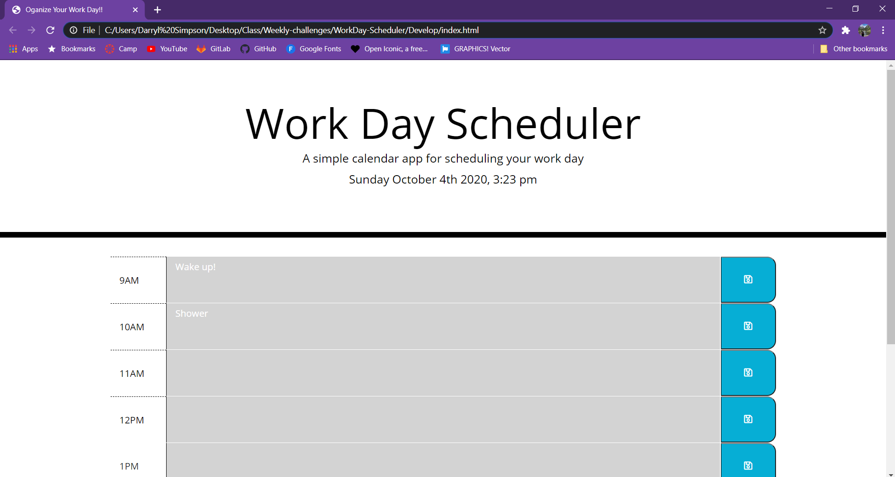
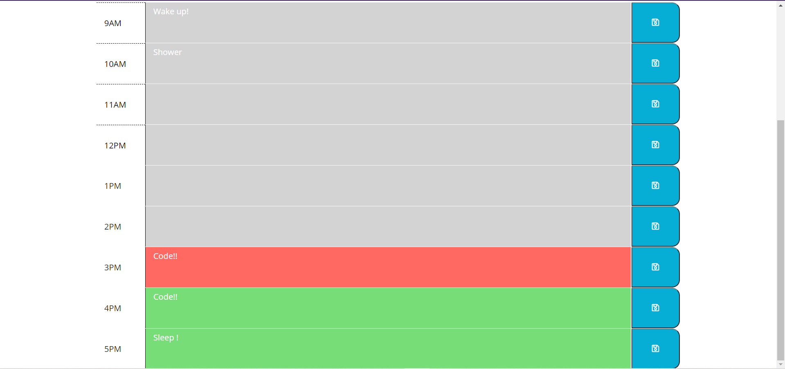
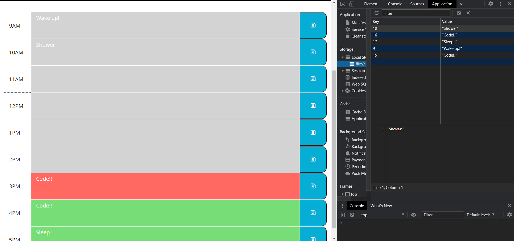

# Schedule Your Weekday!!
* Want to have a reliable web app that can help manage your day and time effectively by neatly storing your schedule and scheduled events? 

## What My Page Does
* GIVEN you are using the daily planner to create your schedule
* WHEN you open this planner
* THEN your current day is displayed at the top of the calendar
* WHEN you scroll down
* THEN you will be presented with time blocks for buisiness hours
* WHEN you view the blocks for that day
* THEN the blocks will be color-coded to indicate whether it is past, present, or future
* WHEN you click into a time black
* THEN you can eneter an event
* WHEN you click save for a time block
* THEN the text will be saved in local storage
* WHEN you refresh the page
* THEN the save event will persist

* WHEN on the page it will refresh every 15 minutes
* SO the user knows whats in the past, present, or future with the coloring of the rows

## Code I Used

* I used a combination of HTML, CSS, and JavaScript to do everything I needed on this page, Utilizing third party API's.

## Images of My Page

## Link to my page Below

[Link to page](https://darrylsimpson.github.io/Schedule-Your-Workday/)

## Creator Info

This was created by Me, Darryl Simpson 

Feel free to contact me at [Darryl.Simpson0793@gmail.com](mailto:Darryl.Simpson0793@gmail.com)
